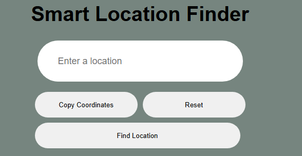

# Smart Location Finder 🌍

A web application that allows users to search for any location worldwide and get detailed geographic information with interactive map visualization.



## 🚀 Features

- **Location Search** - Search for any city, address, landmark, or geographic location
- **Comprehensive Data Display** - View detailed information including:
  - Full address
  - Coordinates (latitude & longitude)
  - Country, state, and city
  - Continent and timezone
  - Location type and category
- **Interactive Map** - Visual representation powered by Leaflet.js with pinpoint markers
- **Copy Coordinates** - One-click copying of coordinates to clipboard
- **Keyboard Support** - Press Enter to search for quick workflow
- **Reset Functionality** - Clear results and start a new search

## 🛠️ Technologies Used

- **HTML5** - Semantic markup structure
- **CSS3** - Responsive styling with CSS custom properties
- **JavaScript (ES6+)** - Core application logic
- **OpenCage Geocoding API** - Location data and coordinates
- **Leaflet.js** - Interactive map visualization
- **OpenStreetMap** - Map tile provider

## 📦 Installation & Setup

1. Clone this repository:

```bash
git clone https://github.com/HarDexTech/geo-api.git
cd geo-api
```

2. Get a free API key from [OpenCage Data](https://opencagedata.com/api)

3. Replace the API key in `script.js`:

```javascript
const apikey = "YOUR_API_KEY_HERE";
```

4. Open `index.html` in your browser

## 💡 Usage

1. Enter any location name in the search box (e.g., "Paris", "Empire State Building", "Tokyo Tower")
2. Click "Find Location" or press Enter
3. View detailed location information and interactive map
4. Click "Copy Coordinates" to copy lat/lon to clipboard
5. Use "Reset" to clear and search again

## 🌐 API Reference

This project uses the [OpenCage Geocoding API](https://opencagedata.com/api):

- **Endpoint**: `https://api.opencagedata.com/geocode/v1/json`
- **Rate Limit**: 2,500 requests/day (free tier)
- **Response Format**: JSON

## 📝 Code Structure

```
smart-location-finder/
├── index.html          # Main HTML structure
├── style.css           # Styling and layout
├── script.js           # Application logic and API calls
└── README.md           # Project documentation
```

## 🎯 Key Learning Points

This project demonstrates:

- Asynchronous JavaScript with `fetch()` and Promises
- API integration and error handling
- DOM manipulation and event handling
- Third-party library integration (Leaflet.js)
- Responsive web design principles
- Modern ES6+ JavaScript features

## 🔒 Security Note

The API key is exposed in client-side code, which is acceptable for:

- Portfolio/learning projects
- Free-tier APIs with request limits
- Non-sensitive geocoding data

For production applications handling sensitive data, implement a backend proxy to secure API keys.

## 🚧 Future Enhancements

- [ ] Search history with local storage
- [ ] Multiple location comparison
- [ ] Reverse geocoding (click map to get location)
- [ ] Distance calculator between two points
- [ ] Export coordinates in different formats
- [ ] Dark mode toggle

## 📄 License

This project is open source and available under the [MIT License](LICENSE).

## 👤 Author

**Your Name**

- GitHub: [@HarDexTech](https://github.com/HarDexTech)
- LinkedIn: [Adesina Ayomide](https://www.linkedin.com/in/hardextech/)

## 🙏 Acknowledgments

- OpenCage Data for geocoding API
- Leaflet.js for map visualization
- OpenStreetMap contributors for map tiles
